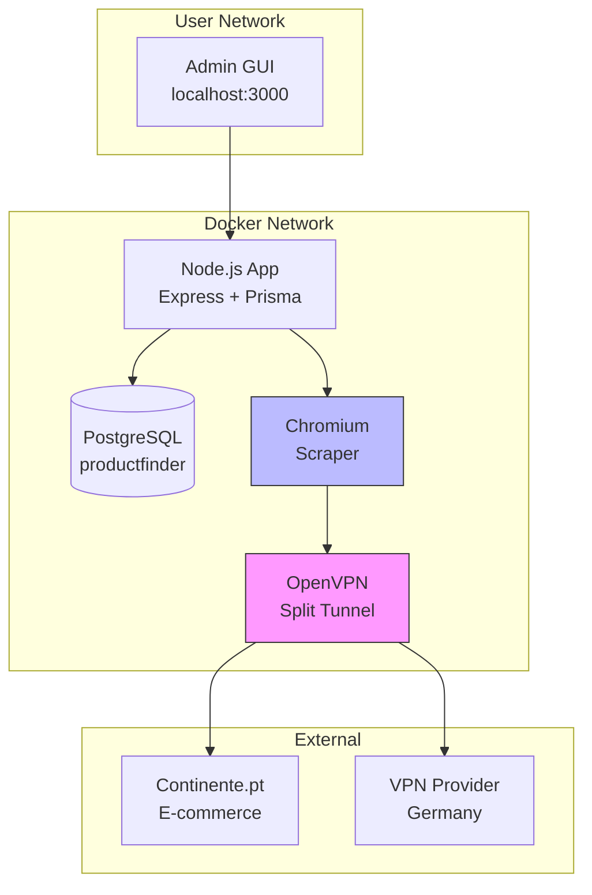
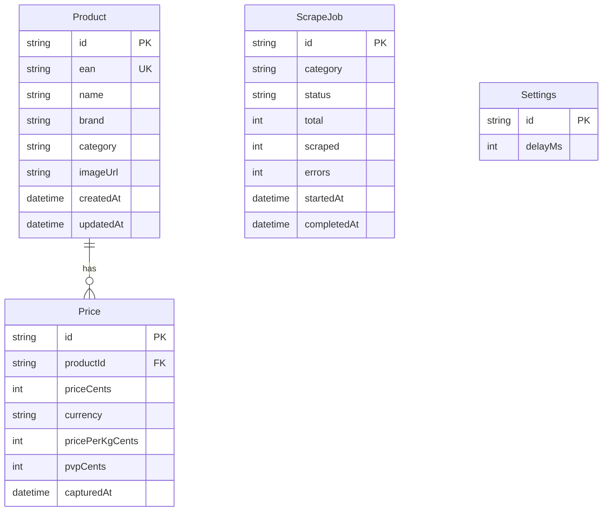
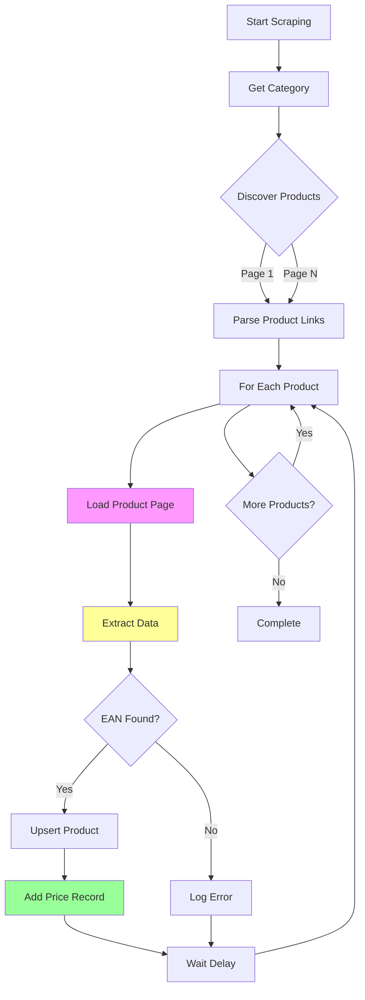

# ProductFinder 🛒

A web scraper for Portuguese supermarket products with database storage, admin GUI, and VPN support for privacy.

## Quick Start

```bash
# Clone and run
docker compose up -d

# Access admin GUI
open http://localhost:3000
```

## Architecture



## Features

- ✅ **Web Scraper**: Extracts products, prices, EAN codes from Continente
- ✅ **VPN Support**: All scraper traffic routes through VPN (split tunneling)
- ✅ **Price Tracking**: Records unit price, price/kg, and PVP (original price)
- ✅ **Price History**: Full audit trail with timestamps
- ✅ **Admin GUI**: Search, view, edit, delete products and prices
- ✅ **Docker**: Runs in isolated container with VPN

## Database Schema



## API Endpoints

### Products
| Method | Endpoint | Description |
|--------|----------|-------------|
| GET | `/api/products` | List products (paginated) |
| GET | `/api/products/:id` | Get product with price history |
| GET | `/api/products/ean/:ean` | Get product by EAN |
| PUT | `/api/products/:id` | Update product |
| DELETE | `/api/products/:id` | Delete product |
| DELETE | `/api/products/price/:priceId` | Delete price record |

### Scraper
| Method | Endpoint | Description |
|--------|----------|-------------|
| GET | `/api/scraper/status` | Get scraper status |
| GET | `/api/scraper/categories` | List available categories |
| POST | `/api/scraper/start` | Start scraping |
| POST | `/api/scraper/stop` | Stop scraping |

### Settings
| Method | Endpoint | Description |
|--------|----------|-------------|
| GET | `/api/settings` | Get settings |
| PUT | `/api/settings` | Update settings |

### VPN
| Method | Endpoint | Description |
|--------|----------|-------------|
| GET | `/api/vpn/status` | Get VPN status and IP |

## Scraper Flow



## Price Extraction Logic

```mermaid
flowchart TD
    A[Get Page Text] --> B[Fix Split Prices]
    B --> C["1<br>,72€" → "1,72€"]
    C --> D[",99€" → "0,99€"]
    D --> E[Find All Prices<br/>regex: \d+[\s,]\\d{2}€]
    E --> F{For Each Price}
    F --> G{Preceded by<br/>PVPR/PVP?}
    G -->|Yes| H[Skip - it's PVP]
    G -->|No| I{Followed by<br/>/kg?}
    I -->|Yes| J[Price per kg]
    I -->|No| K{First Non-PVP<br/>Price?}
    K -->|Yes| L[Unit Price]
    K -->|No| M[Skip]
    H --> F
    J --> F
    L --> F
    M --> F
    
    L --> N[Store: priceCents]
    J --> O[Store: pricePerKgCents]
    H --> P[Store: pvpCents]
```

## Environment Variables

| Variable | Default | Description |
|----------|---------|-------------|
| DATABASE_URL | postgresql://postgres:postgres@db:5432/productfinder | Database connection |
| PORT | 3000 | HTTP server port |
| PUPPETEER_EXECUTABLE_PATH | /ms-playwright/chromium-1105/chrome-linux/chrome | Chrome executable path |

## VPN Setup

1. Place your OpenVPN config in `vpn/client.ovpn`
2. Add credentials to `vpn/credentials.txt`:
   ```
   your_username
   your_password
   ```
3. Docker will auto-connect VPN on startup

### Split Tunneling

Only Continente traffic goes through VPN:
- ✅ Continente.pt requests → VPN
- ✅ Admin GUI → Regular network
- ✅ Database → Regular network

## Categories

- `mercearia` - Grocery
- `frescos-frutas` - Fresh: Fruits
- `frescos-legumes` - Fresh: Vegetables  
- `frescos-talho` - Butcher
- `frescos-peixaria` - Fishmonger
- `laticinios` - Dairy & Eggs
- `congelados` - Frozen
- `bebidas` - Beverages

## Development

```bash
# Install dependencies
npm install

# Run database migrations
npx prisma migrate deploy

# Start in development
npm run dev
```

## License

MIT
