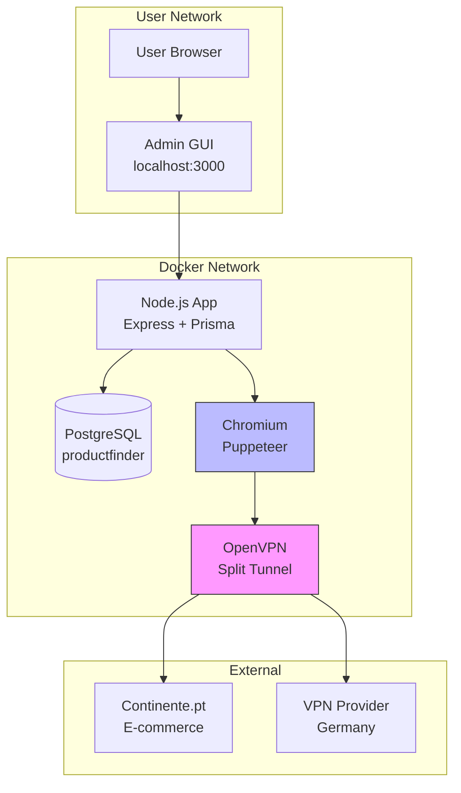
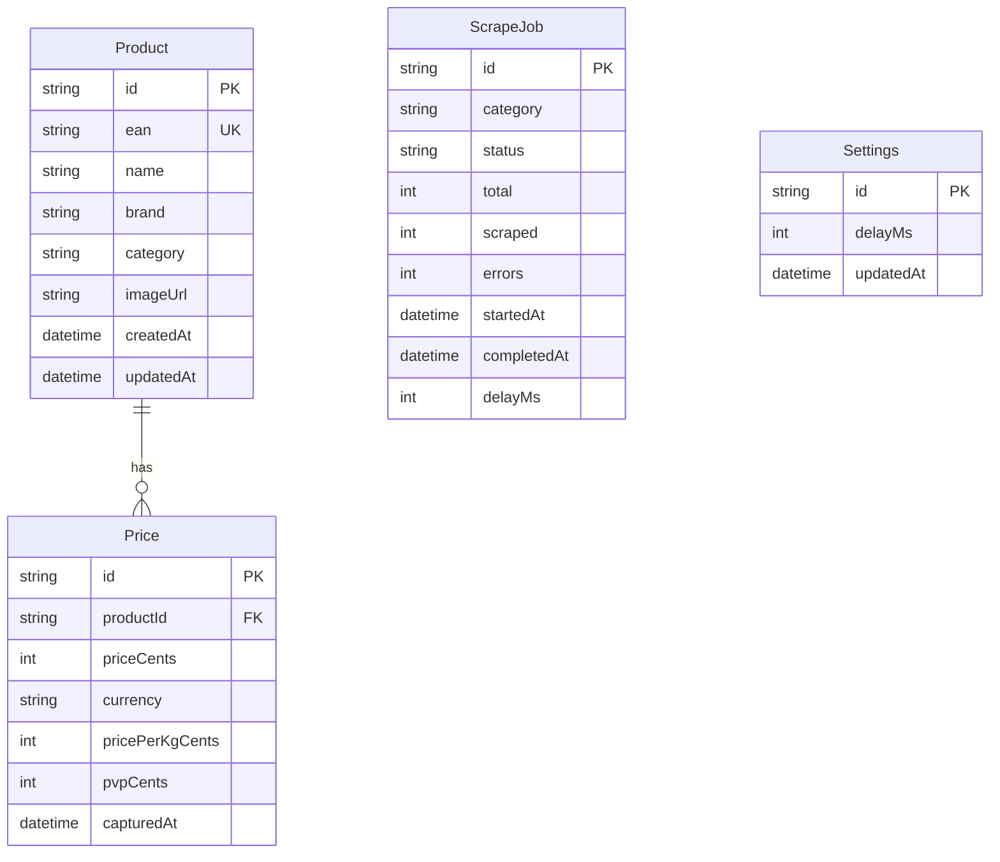
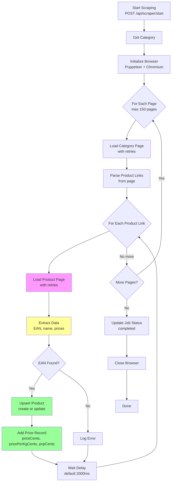
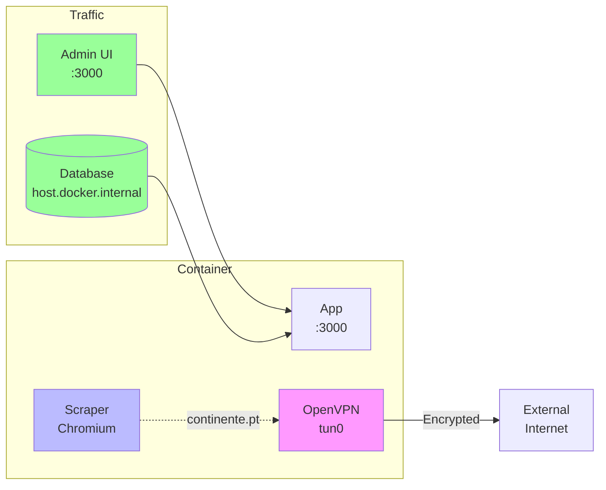

# ProductFinder 🛒

Web scraper for Portuguese supermarket products with database storage, admin GUI, and VPN support for privacy.

## Quick Start

```bash
# Clone and run
docker compose up -d

# Access admin GUI
open http://localhost:3000
```

## Architecture



## Features

- ✅ **Web Scraper**: Extracts products, prices, EAN codes from Continente
- ✅ **VPN Support**: All scraper traffic routes through VPN (split tunneling)
- ✅ **Price Tracking**: Records unit price, price/kg, and PVP (original price)
- ✅ **Price History**: Full audit trail with timestamps
- ✅ **Admin GUI**: Search, view, edit, delete products and prices
- ✅ **Docker**: Runs in isolated container with VPN

---

## Database Schema



---

## API Endpoints

### Products

| Method | Endpoint | Description |
|--------|----------|-------------|
| GET | `/api/products` | List products (paginated, searchable) |
| GET | `/api/products/:id` | Get product with price history |
| GET | `/api/products/ean/:ean` | Get product by EAN |
| GET | `/api/products/meta/stats` | Get database statistics |
| GET | `/api/products/meta/categories` | List unique categories |
| PUT | `/api/products/:id` | Update product (name, brand, category, imageUrl) |
| DELETE | `/api/products/:id` | Delete product and all prices |
| DELETE | `/api/products/price/:priceId` | Delete single price record |

### Scraper

| Method | Endpoint | Description |
|--------|----------|-------------|
| GET | `/api/scraper/status` | Get current scraping status |
| GET | `/api/scraper/categories` | List available categories |
| POST | `/api/scraper/start` | Start scraping (body: `{category, limit}`) |
| POST | `/api/scraper/stop` | Stop current scrape |

### Settings

| Method | Endpoint | Description |
|--------|----------|-------------|
| GET | `/api/settings` | Get scraper settings |
| PUT | `/api/settings` | Update settings (body: `{delayMs}`) |

### VPN

| Method | Endpoint | Description |
|--------|----------|-------------|
| GET | `/api/vpn/status` | Get VPN connection status and IP |

---

## Scraper Flow



---

## Price Extraction Logic

Continente displays prices in multiple formats. The scraper handles:

1. **Split prices**: `1` + `,72€` → `1,72€`
2. **Missing zero**: `,99€` → `0,99€`  
3. **Price per kg**: `1,38€` + `/kg`
4. **PVP (original)**: `PVPR 1,69€`

```mermaid
flowchart TD
    A[Get Page Text] --> B[Split by Newlines]
    B --> C{Fix Split Prices}
    
    C --> D["1<br>,72€" → "1,72€"]
    C --> E[",99€" → "0,99€"]
    C --> F["1,38€<br>/kg" → "1,38€/kg"]
    
    D --> G[Join Text]
    E --> G
    F --> G
    
    G --> H[Find All Prices<br/>regex: \d+[\s,]\\d{2}€]
    
    H --> I{For Each Price}
    
    I --> J{Preceded by<br/>PVPR/PVP?}
    J -->|Yes| K[Mark as PVP<br/>skip for unit price]
    J -->|No| L{Followed by<br/>/kg?}
    
    L -->|Yes| M[Mark as Price/kg]
    L -->|No| N{First Non-PVP<br/>Non-kg Price?}
    N -->|Yes| O[Mark as Unit Price]
    N -->|No| P[Ignore]
    
    K --> I
    M --> I
    O --> I
    P --> I
    
    O --> Q[Return: price, pricePerKg, pvp]
    M --> Q
    K --> Q
```

---

## VPN Setup & Split Tunneling

### How It Works



### Setup

1. Place OpenVPN config in `vpn/client.ovpn`
2. Add credentials to `vpn/credentials.txt`:
   ```
   your_username
   your_password
   ```
3. Docker auto-connects VPN on startup

### Split Tunneling

| Traffic | Route |
|---------|-------|
| Admin GUI (:3000) | Regular network |
| Database | Regular network |
| Continente.pt | VPN (tun0) |

---

## Categories

| ID | Name | Est. Products |
|----|------|----------------|
| mercearia | Grocery | ~5,400 |
| frescos-frutas | Fresh: Fruits | ~1,500 |
| frescos-legumes | Fresh: Vegetables | ~1,200 |
| frescos-talho | Butcher | ~800 |
| frescos-peixaria | Fishmonger | ~600 |
| laticinios | Dairy & Eggs | ~1,500 |
| congelados | Frozen | ~1,200 |
| bebidas | Beverages | ~2,000 |

---

## Environment Variables

| Variable | Default | Description |
|----------|---------|-------------|
| DATABASE_URL | postgresql://postgres:postgres@db:5432/productfinder | Database connection |
| PORT | 3000 | HTTP server port |
| PUPPETEER_EXECUTABLE_PATH | /ms-playwright/chromium-1105/chrome-linux/chrome | Chrome executable |

---

## Development

```bash
# Install dependencies
npm install

# Generate Prisma client
npx prisma generate

# Run migrations
npx prisma migrate deploy

# Start development
npm run dev
```

---

## Example API Calls

```bash
# Start scraping Mercearia
curl -X POST http://localhost:3000/api/scraper/start \
  -H "Content-Type: application/json" \
  -d '{"category": "mercearia", "limit": 100}'

# Get products with pagination
curl "http://localhost:3000/api/products?page=1&limit=50"

# Search products
curl "http://localhost:3000/api/products?search=atum"

# Get product by EAN
curl http://localhost:3000/api/products/ean/5601029004014

# Update settings (delay between requests)
curl -X PUT http://localhost:3000/api/settings \
  -H "Content-Type: application/json" \
  -d '{"delayMs": 3000}'

# Check VPN status
curl http://localhost:3000/api/vpn/status
```

---

## License

MIT
